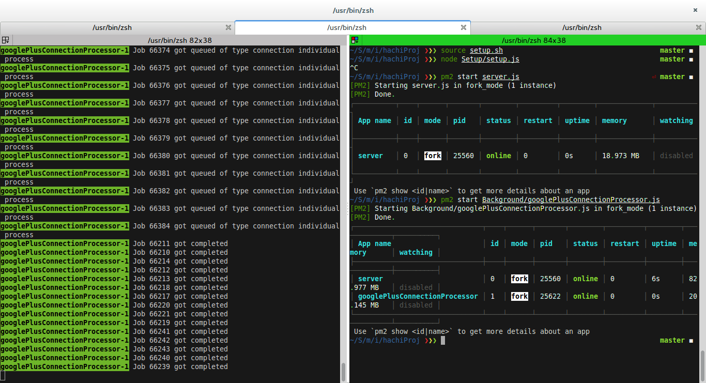

# hachi-candidate-seeker
Assignment application for hachi interview

## Table of content

- [Installation](#introduction)
- [Setup](#setup)
- [Usage](#usage)
- [Candidatelist generation](#candidatelist-generation)
    - [User registration](#user-registration)
    - [Background processing](#background-processing)
    - [Dataprocessing and storage](#dataprocessing-and-storage)
- [Data retreival](#data-retreival)
    - [GET request](#get-request)
    - [Ranking](#ranking)
- [Improvements](#improvements)

##Introduction
This an application completely written in nodejs, The background jobs are created using [Kue](https://github.com/Automattic/kue). It uses [Elasticsearch](https://www.elastic.co/products/elasticsearch) as a datastore for fast retreivel and indexing.

The application suggests candidates for a job based on the reqruirements by looking through the a candidate list that is preprocessed and generate using background jobs. 

##Dependencies
    
    node >= v5.8.0
    npm >= v3.7.3
    elasticsearch >= v2.2
    redis >= v2.8.4

##Setup
  After ensuring all the depenedencies have been met, clone the project and use

    $ npm install
  
##Usage

    $ source setup.sh #sets api keys and other environment variable
    $ node Setup/setup.js     #runs the basic setup required for indices in elasticsearch,clears the queue's
    $ pm2 start server.js     #runs the main server
    $ pm2 start Background/googlePlusConnectionProcessor.js     #runs the google plus connection processor
refer to [pm2](https://github.com/Unitech/pm2) for more details about using the PM2 process manager. Please note the api  keys and tokens are all set as enviroment varaibles hence ommited in the public repo.

##Candidatelist generation
The candidatelist is generate in 3 stages

####User registration
Users can sign into the application, By clicking on the signIn button on the top left corner of the application.
Presently Google+ is the only authentication available. 

# 

The code for this is in the file [googlePlusRoutes](Routes/googlePlusRoutes.js).
####Background processing
Once an user is signed into the application, The background processes use the users credentials to parse through list of people they are connected to (Which in case of Google+ are people in their circles).

# 

The code for this is in the file [googlePlusConnectionProcessor](Background/googlePlusConnectionProcessor.js).
####Dataprocessing and storage
While parsing through the connections releveant data is processed and is stored into Elasticsearch in a common format. Note that while the parsing step and authenticaton and parsing stages might differ for different social networks. Storing data in a common format is useful for data retreival. Note that more the number of users signed in more the candidate list will be.

The code for converting Google+ data into a common format can be found in [Utils](Utils/Utils.js).

##Data retreival

####GET request
The top 10 candidates suitable for the job can be obtained by sending a request to [http://localhost:3000/requests/jobRequest](http://slocalhost:3000/requests/jobRequest). The get request requires parameters to be sent in json format.

    {
      job: {
        "title": "<string> containing job title",
        "skills": "<string> containing the set of skills relevant or required for the job",
        "description": "<string> containing a brief description of the job"
      }
    }
This can be done by entering job details on the home page. 

####Ranking
The ranking is done based on how a candidate suits the specified requirements. This is done using text matching and assigning prioritites to each of the above mentioned properties ([more info](https://www.elastic.co/guide/en/elasticsearch/guide/current/_boosting_query_clauses.html)). The code for this can be found in  [jobRequestRoutes](Requests/jobRequestRoutes.js)

# 

# 

##Improvements
1.  Background parsing and conversion has to be improved to store more relevant data.
2.  Since google+ other api's have a requestso per second limit, The background processes need to be tuned for that.
3.  Caching can be implemented so that a user profile is not parsed multiple times, As of now redundancy in storage is eliminated using Elasticsearch features.
4.  Failures in parsing due to api call overload are not being handled, once a request fails the corresponding connection data is lost. This can be done by parsing user connections again and again untill all data is obtained.
5.  Changes in user data has to be accounted for, this can be done by implementing a caching mechanism using etags.
